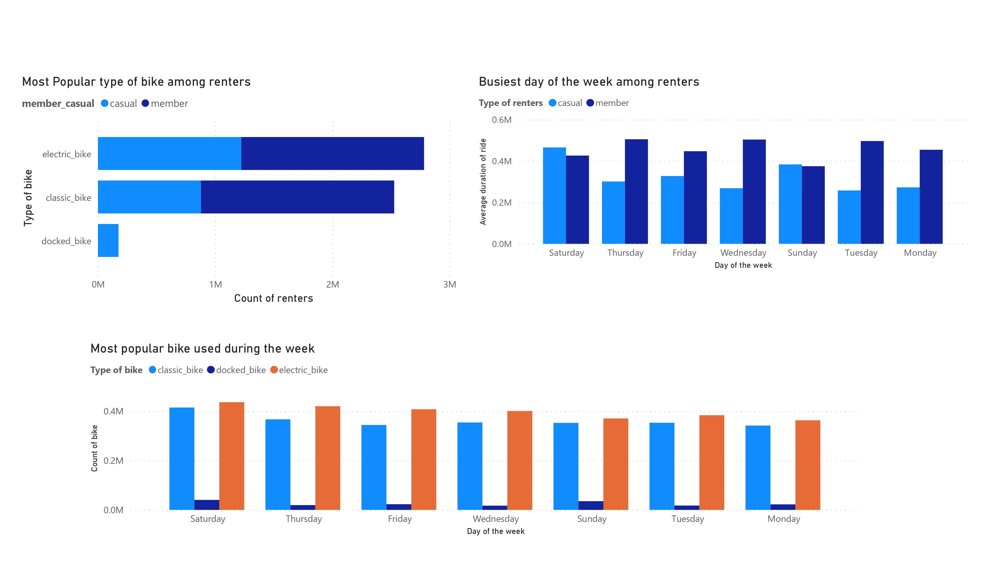
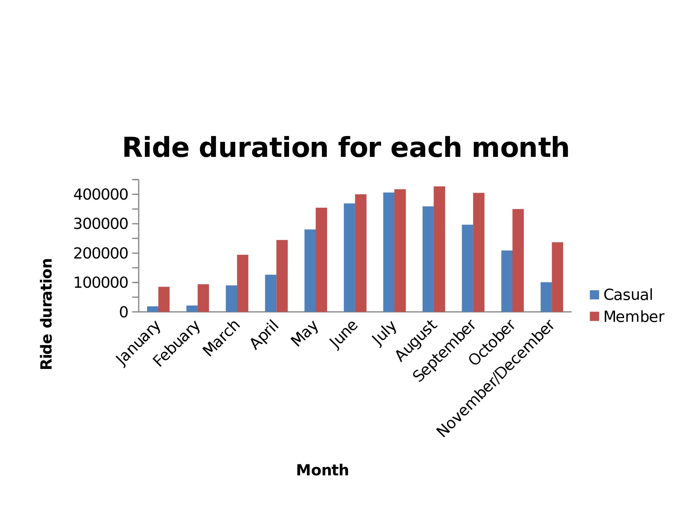

# Cyclistic Bike Share Data Analysis

## Introduction
The dataset used, formed part of my google capstone project (case study 1) which led to the award of google analytics certificate.  Tools used; Excel, SQL, Power BI

## Problem Statement
As a junior data analyst with Cyclistic, I am faced with the problem of providing a new marketing strategy that will convert casual riders (those who purchase full day passes) to Cyclistic members (those that purchase annual passes). In order to achieve my goal, the following problems were stated;
1.	What is the most popular type of bike among renters?
2.	What is the busiest day of the week among renters?
3.	What is the most popular bike used during the week?
4.	What is the ride duration for each month?

## Skills Demonstrated
This project enable me practice my skills in data cleaning, analysis and visualization.

## Data Sourcing
The data was made available by Motivate International Inc. (a licensed firm). It is a public data downloaded from divvy-tripdata [Click here](https://divvy-tripdata.s3.amazonaws.com/index.html). 
Motivate International Inc. maintained data-privacy issues by prohibiting the use of riders’ personal identifiable information from the public. 

## Data Transformation
For the data cleaning I used Excel and then merge the monthly data into a single data in SQL before continuing with use of Power BI;
#### Excel
I downloaded the csv file of the data from January to November/December 2022.
I made a copy of all the dataset while the new copies served as the working copies.
I deleted some column that had no relevant to my analyses from the working copies. Then I added three new columns: 
1.	ride_length calculated from ending time minus starting time from each stations.
2.	day_of_week calculated the day of the week for each trip using the start_at column date.
3.	Month of each dataset was inserted

#### SQL
Since the number of rows for all the dataset exceeds 5 million which cannot be worked on directly or modeled in Microsoft excel 2010 which I am presently using. I uploaded each month into Postgresql then Union them using the following query; 
- SELECT* FROM tripdata
UNION
- SELECT* FROM tripdatafeb
UNION
- SELECT* FROM tripdatamar
UNION
- SELECT* FROM tripdataapril
UNION
- SELECT* FROM tripdatamay
UNION
- SELECT* FROM tripdatajune
UNION
- SELECT* FROM tripdatajuly
UNION
- SELECT* FROM tripdataaug
UNION
- SELECT* FROM tripdatasep
UNION
- SELECT* FROM tripdataoct
UNION
- SELECT* FROM tripdatanovdec;

The new file was saved as tripdataall_months.
Then I export the tripdataall_months from postgresql using the following query;
- SELECT * FROM tripdataall_months
COPY(SELECT * FROM tripdataall_months) TO 
'C:\Users\Public\tripdataall_months.csv'DELIMITER ',' CSV HEADER;
It was an heavy file above 500 mb.

## Analysis and Visualization
#### Power BI
The file was uploaded into Power BI for visualization while the visualization of ride duration per month was done in excel using pivot table (decision to carry-out this came at a later time).
On which bike is more popular; I discovered that classic bike is popular among annual members (1649057 bikes) than casual riders but electric bike was the most popular bike generally among renters (2782498 bikes). Then followed is electric bike but it is uniformly popular among all members while docked bike is the least popular and it is used among casual members only.
From the analysis, there was uniform growth of annual members’ participation in ride during the week from Monday to Friday but casual riders use the service mostly during the weekend and Saturday was the busiest. 
Also, electric bike and classic bike were mostly used on Saturday which is the busiest day in the week.

Finally the ride duration per month among renters showed that annual members and casual riders’ use of service increased from January to August then started to go downward this can be due to seasonal changes. August is warmer with frequent travel among people unlike September to March which is cold.

## Conclusion 
In conclusion, to convert casual riders to annual members there is need for the organization to provide incentives by reducing the subscription fees for annual members while at the same time increasing the casual riders’ fees making it less attractive.
The marketing team can get annual members to discuss about the benefit they have been gaining through using the service which will serve as motivation for casual riders to join.
## Recommendation
To be frank giving advice to the marketing team was hard because lot of variables were missing from this file which made it impossible to determine the economic contribution of each type of riders which can help the organization to know how to market the services to casual riders or new customers and at the same time knowing if converting casual members to annual members will be profitable at long run.
 

